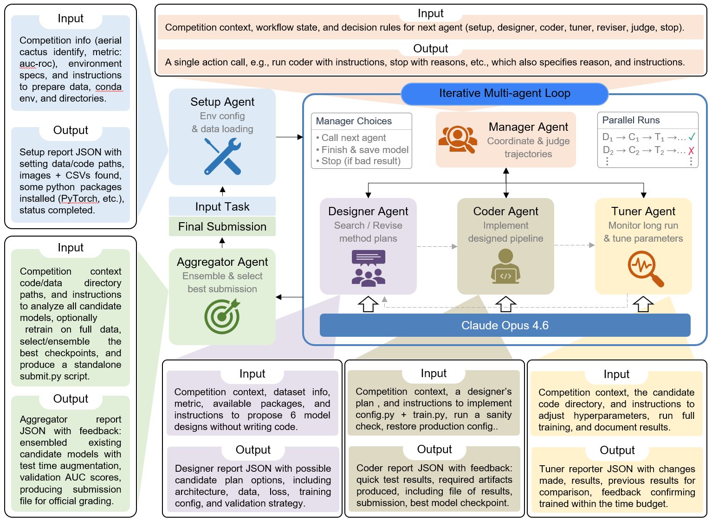
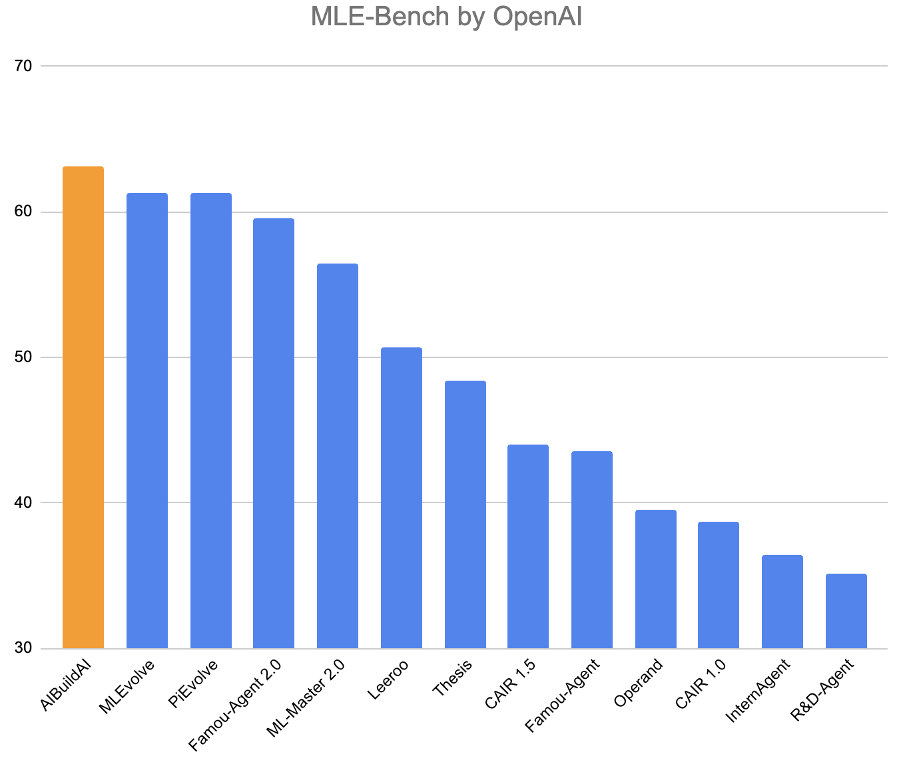

<h1 align="center"><small>AIBuildAI – An AI agent that automatically builds AI models</small></h1>

<h1 align="center"><sub>🏆 #1 on OpenAI <a href="https://github.com/openai/mle-bench/pull/126">MLE-Bench</a></sub></h1>


<p align="center">
  
</p>

---

https://github.com/user-attachments/assets/b6043d39-43df-464a-8e25-d24006ba99c8

---


## Introduction

AIBuildAI is an AI agent that automatically builds AI models. Given a task, it runs an agent loop that analyzes the problem, designs a model, writes the code to implement it, trains the model, performs hyperparameter tuning, evaluates model performance, and iteratively refines the solution. By automating the model development workflow, AIBuildAI reduces much of the manual effort required to build AI models.

<p align="center">
  
</p>

---

## Current Results

On OpenAI [MLE-Bench](https://github.com/openai/mle-bench/pull/126), AIBuildAI ranked #1 (excluding methods that used leaked test labels), demonstrating strong performance on real-world AI model building tasks.

<p align="center">
  
</p>

---

## Quick Start

### Installation

AIBuildAI requires a **Linux x86_64** machine.

```bash
curl -L -O https://github.com/aibuildai/AI-Build-AI/releases/latest/download/aibuildai-linux-x86_64-v0.1.0.tar.gz
tar -xzf aibuildai-linux-x86_64-v0.1.0.tar.gz
cd aibuildai-linux-x86_64-v0.1.0
./install.sh
```

### Set up credentials

```bash
export ANTHROPIC_API_KEY=your-api-key
```

### Run

**Example task:** Predict the enzyme class of a protein from its amino acid sequence ([Yu et al., *Science* 2023](https://www.science.org/doi/10.1126/science.adf2465)).

```bash
aibuildai --task-name protein-ec-prediction \
  --data-dir data/protein-ec-prediction \
  --playground-dir /path/to/playground \
  --model claude-opus-4-6 \
  --max-agent-calls 8 \
  --run-budget-minutes 60 \
  --num-candidates 3 \
  --instruction "$(cat tasks/protein-ec-prediction.md)" \
  --pipeline-budget-minutes 90 \
  --no-form
```

AIBuildAI takes two key inputs: `--data-dir`, the path to the training data for the task, and `--instruction`, a natural-language description of the AI task to solve.


**Important:**

Run the command directly in your terminal. Do not wrap the command in a `.sh` or `.bash` script. Running it through a script may cause the TUI (Text User Interface) to crash.

### Results

#### Output directory

After a run completes, the output directory usually looks like (structure may slightly vary by task):

```
├── candidate_1/  candidate_2/  candidate_3/  # Auto-generated training scripts and model checkpoints
├── checkpoint.pth       # Best model checkpoint
├── inference.py         # Standalone inference script for the final model
├── submission.csv       # Test predictions (if test inputs are provided)
└── progress.pdf         # Visual progress report
```

The main outputs of an AIBuildAI run are the model checkpoints and the script `inference.py`, which runs predictions with the final model on any data.

#### Evaluation

In the example protein-ec-prediction task, we provide unlabeled test data in the data folder, so AIBuildAI also generates a predicted-label file `submission.csv`. To evaluate the predictions against ground-truth labels:

```bash
python scripts/eval_protein_ec.py \
  --labels data/labels/protein-ec-prediction.csv \
  --submission /path/to/playground/code/protein-ec-prediction/timestamp/submission.csv
```

### Other tasks

We provide additional task markdowns in the `tasks/` folder. You can also write your own task markdown and point `--data-dir` to your own dataset.

---

### Command line options

To see all available options, run:

```bash
aibuildai -h
```

### Interactive form mode 

Alternatively, you can run AIBuildAI using the interactive form interface by running without `--no-form`:

```bash
aibuildai
```

This will launch a TUI (Text User Interface) where you can fill in the required parameters interactively.

---

## License

This project is licensed under the Apache License 2.0 - see the [LICENSE](LICENSE) file for details.

---

## Citation

```bibtex
@misc{zhang2026aibuildai,
  title={AIBuildAI: An AI Agent that Automatically Builds AI Models},
  author={Ruiyi Zhang and Peijia Qin and Qi Cao and Li Zhang and Pengtao Xie},
  year={2026}
}
```


