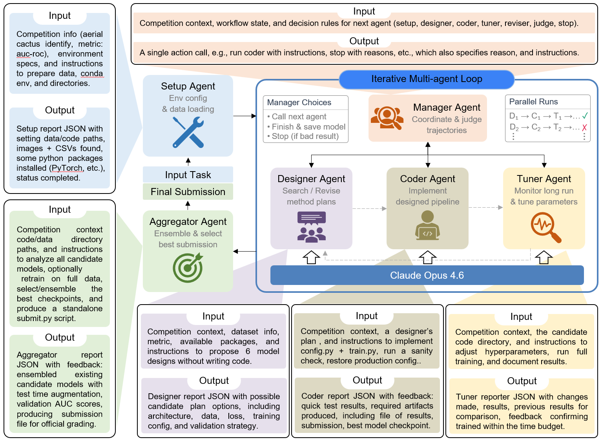
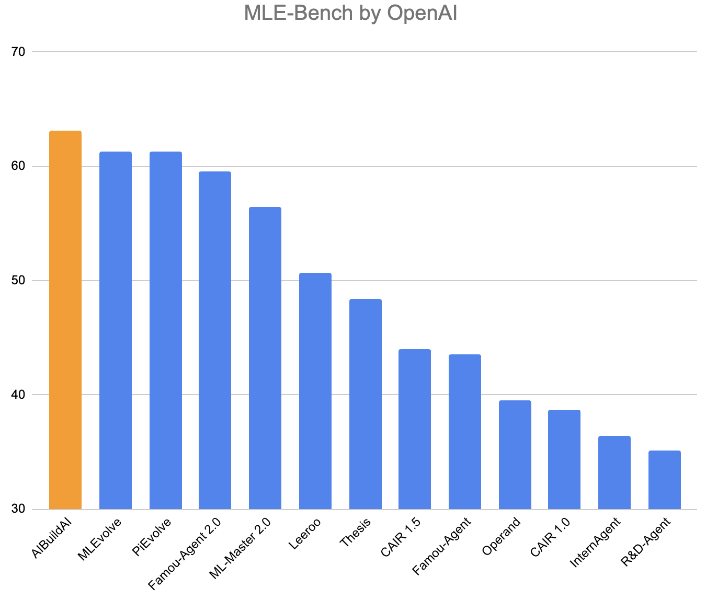
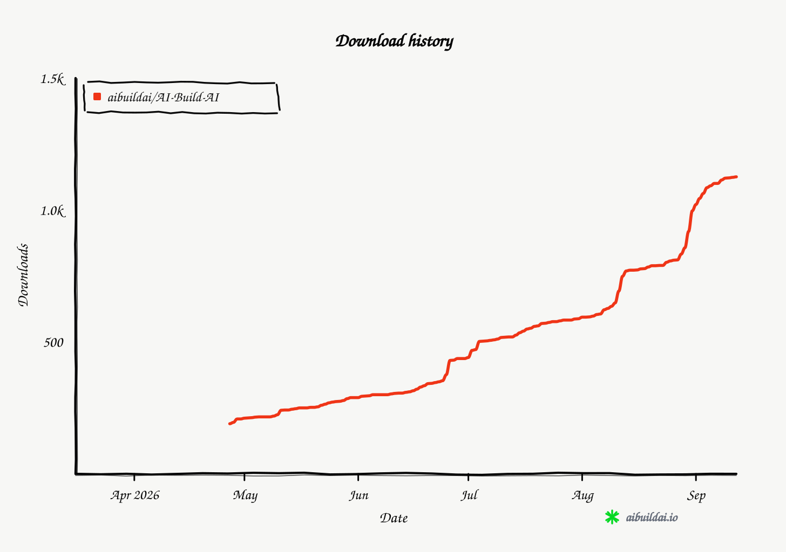

<h1 align="center"><small>AIBuildAI – An AI agent that automatically builds AI models</small></h1>

<h1 align="center"><sub>🏆 #1 on OpenAI <a href="https://github.com/openai/mle-bench">MLE-Bench</a></sub></h1>

<p align="center">
  
  <a href="https://arxiv.org/abs/2604.14455">
  
  </a>
  <a href="https://arxiv.org/abs/2605.27873">
  
  </a>
</p>

---

## News

- **[8/4/2026]** **AIBuildAI Science** is available to [Science users](https://www.aibuildai.io/#products): a second search method built for scientific work, OpenAI models, tasks from a description, paper writing, per-run GPU selection, kernel-enforced resource ceilings, and resume without editing. [Release notes and download](https://github.com/aibuildai/AI-Build-AI/releases/tag/science-2026-08-04).
- **[8/3/2026]** AIBuildAI autonomously post-trained NVIDIA's open Cosmos world model for robot video prediction, with no human intervention. On the official IRASim RT-1 trajectory-to-video benchmark, the delivered model scores 25.56 PSNR and 0.845 SSIM, the highest published SSIM on this benchmark to date, up from the base model's 17.75 PSNR and 0.716 SSIM. [Read the blog post](https://www.aibuildai.io/blog-robot-world-model). Model and code developed by the Agent: [tasks/robot-world-model-post-training](https://github.com/aibuildai/AI-Build-AI/tree/main/tasks/robot-world-model-post-training). Model weights: [AIBUILDAI-Inc/robot-world-model](https://huggingface.co/AIBUILDAI-Inc/robot-world-model).
- **[7/20/2026]** AIBuildAI built a state-of-the-art model for reliable anomalous diffusion analysis, surpassing the method by Feng et al. published in *Nature Computational Science* in 2024 across 8 of 10 settings. [Read the blog](https://www.aibuildai.io/blog-anomalous-diffusion).
- **[6/17/2026]** The **AIBuildAI Agent 2.5** version is made available to [Max users](https://www.aibuildai.io/#products): a live build dashboard, run replay, cross-run memory, MCP research tools, and DeepSeek support. [Release notes and download](https://github.com/aibuildai/AI-Build-AI/releases/tag/v2.5.1).
- **[5/26/2026]** The **AIBuildAI Agent 2.0** version is made available to [Pro users](https://www.aibuildai.io/#products).
- **[5/1/2026]** In the [TGS Salt Identification Challenge](https://www.kaggle.com/competitions/tgs-salt-identification-challenge) hosted by Kaggle, the model automatically developed by our AIBuildAI Agent ranked in the top 5.7%. Among 3,219 teams composed of human experts, this performance reaches the level of top-tier human AI experts. Model and code developed by the Agent: [tasks/tgs-salt-identification-challenge](https://github.com/aibuildai/AI-Build-AI/tree/main/tasks/tgs-salt-identification-challenge).
- **[4/27/2026]** Excited to announce **AIBuildAI Agent 2.0**! It has once again achieved #1 on OpenAI's MLE-Bench, reaching a score of 70.7% and substantially outperforming the agents ranked 2nd through 5th. Compared to version 1.0, Agent 2.0 introduces several technical advancements, which we will detail in an upcoming technical report. The 2.0 version will be available to Pro users soon.
- **[4/24/2026]** In a [heart disease prediction competition](https://www.kaggle.com/competitions/playground-series-s6e2/overview) hosted by Kaggle, the model automatically developed by our AIBuildAI Agent ranked in the top 6.6%. Among 4,370 teams composed of human experts, this performance reaches the level of top-tier human AI experts. Model and code developed by the agent: [tasks/playground-series-s6e2](https://github.com/aibuildai/AI-Build-AI/tree/main/tasks/playground-series-s6e2).

---

https://github.com/user-attachments/assets/b6043d39-43df-464a-8e25-d24006ba99c8

---


## Introduction

AIBuildAI is an AI agent that automatically builds AI models. Given a task, it runs an agent loop that analyzes the problem, designs models, writes code to implement them, trains them, tunes hyperparameters, evaluates model performance, and iteratively improves the models. By automating the model development workflow, AIBuildAI reduces much of the manual effort required to build AI models.

<p align="center">
  
</p>

---

## Current Results

On OpenAI [MLE-Bench](https://github.com/openai/mle-bench), AIBuildAI ranked #1, demonstrating strong performance on real-world AI model building tasks.

<p align="center">
  
</p>

---

## Quick Start

AIBuildAI requires a **Linux x86_64** machine (Ubuntu 20.04 or newer).

There are four versions. **AIBuildAI Science** is the current, most capable version. **V2.5 (Max)**, **V2 (Pro)** and **V1 (free)** remain available.

| Version | Plan | To run it |
|---|---|---|
| **AIBuildAI Science** — current | Science subscription | `aibuildai login` (Science plan) + a Claude Code login or model API key |
| **V2.5 (Max)** | Max subscription | `aibuildai login` (Max plan) + a Claude Code login or model API key |
| **V2 (Pro)** | Pro subscription | `aibuildai login` (Pro plan) + a Claude Code login or Anthropic API key |
| **V1** | free | a Claude Code login or Anthropic API key (no account) |

Subscriptions are managed at [accounts.aibuildai.io](https://accounts.aibuildai.io); see the account page for the available plans.

Two things differ between the four editions, so read the section for the edition you installed and no other. **How you start a run:** Science and V2.5 are driven by a YAML config file; V2 and V1 are driven by command-line flags, and have no `aibuildai config` command. **Which variable holds your API key:** Science and V2.5 read `AIBUILDAI_API_KEY`, which carries the key for whichever model provider you configure; V2 and V1 read `ANTHROPIC_API_KEY`, the variable the bundled Claude Code reads for itself. Each section below gives the exact command for its edition.

### AIBuildAI Science — current

1. **Subscribe.** Create an account at [accounts.aibuildai.io/sign-up](https://accounts.aibuildai.io/sign-up) and switch to the **Science** plan.

2. **Install.**

   ```bash
   curl -fsSL https://raw.githubusercontent.com/aibuildai/AI-Build-AI/main/install.sh | AIBUILDAI_LINE=science sh
   ```

3. **Log in** (required before running):

   ```bash
   aibuildai login      # opens a browser to sign in
   aibuildai whoami     # should show an active Science plan
   ```

4. <a id="science-credentials"></a>**Sign in to Claude Code or set your API key.**

   If Claude Code is already signed in on this machine, no Anthropic API key
   is needed. AIBuildAI automatically uses the local Claude Code credentials.

   If Claude Code is not signed in, run:

   ```bash
   claude auth login
   ```

   You can also use an API key instead. On this edition the key always goes in `AIBUILDAI_API_KEY`, whichever model provider you configure:

   ```bash
   export AIBUILDAI_API_KEY=your-anthropic-api-key
   ```

   To use OpenAI models, set a `gpt-*` model in the config. If Codex is signed in, that login is used; otherwise put your OpenAI key in `AIBUILDAI_API_KEY`.

   To use DeepSeek, set a `deepseek-*` model in the config and put your DeepSeek API key in `AIBUILDAI_API_KEY`.

5. **Run.** AIBuildAI Science is driven by a **YAML config**, not by command-line flags. You write a config file and pass that file to `aibuildai run`:

   ```bash
   aibuildai config > task.yaml    # writes a starter config with every field
   # edit task.yaml: set run.task_name, run.data_root, run.playground_root
   aibuildai run task.yaml
   ```

   **Where your data goes.** On this edition `run.data_root` is the task folder itself: the directory holding what the task means plus every material the task needs. The run reads that folder whole and expects no layout inside it. If the path does not exist, the run stops before any model call with `no task folder found at ...`.

   As a ready-to-run example, this repository ships [`tasks/protein-ec-prediction-science.yaml`](tasks/protein-ec-prediction-science.yaml), a config for the [protein EC number prediction task](#ec-example) described under V1, together with its dataset. Clone the repo, point `run.playground_root` at a directory of your choice, and run it directly:

   ```bash
   git clone https://github.com/aibuildai/AI-Build-AI.git
   cd AI-Build-AI
   # Edit tasks/protein-ec-prediction-science.yaml first: set run.playground_root
   # to a writable directory of your choice. It ships as a placeholder.
   aibuildai run tasks/protein-ec-prediction-science.yaml
   ```

   Other commands: `aibuildai resume` (resume a stopped run), `aibuildai memorize` (summarize past runs into memory), `aibuildai replay <run-dir>` (replay a finished run), `aibuildai --help`.

### V2.5 (Max)

1. **Subscribe.** Create an account at [accounts.aibuildai.io/sign-up](https://accounts.aibuildai.io/sign-up) and switch to the **Max** plan.

2. **Install.**

   ```bash
   curl -fsSL https://raw.githubusercontent.com/aibuildai/AI-Build-AI/main/install.sh | AIBUILDAI_LINE=v2.5 sh
   ```

3. **Log in** (required before running):

   ```bash
   aibuildai login      # opens a browser to sign in
   aibuildai whoami     # should show an active Max plan
   ```

4. <a id="v2-5-credentials"></a>**Sign in to Claude Code or set your API key.**

   If Claude Code is already signed in on this machine, no Anthropic API key
   is needed. AIBuildAI automatically uses the local Claude Code credentials.

   If Claude Code is not signed in, run:

   ```bash
   claude auth login
   ```

   You can also use an API key instead. On this edition the key always goes in `AIBUILDAI_API_KEY`, whichever model provider you configure:

   ```bash
   export AIBUILDAI_API_KEY=your-anthropic-api-key
   ```

   To use DeepSeek, set a `deepseek-*` model in the config and put your
   DeepSeek API key in `AIBUILDAI_API_KEY`.

5. **Run.** V2.5 is driven by a **YAML config**, not by command-line flags. You write a config file and pass that file to `aibuildai run`:

   ```bash
   aibuildai config > task.yaml    # writes a starter config with every field
   # edit task.yaml: set run.task_name, run.data_root, run.instruction, run.playground_root
   aibuildai run task.yaml
   ```

   As a ready-to-run example, this repository ships [`tasks/protein-ec-prediction-max.yaml`](tasks/protein-ec-prediction-max.yaml), a config for the [protein EC number prediction task](#ec-example) described under V1, together with its dataset. Clone the repo, point `run.data_root` at the dataset folder in the clone and `run.playground_root` at a writable output directory, and run it:

   ```bash
   git clone https://github.com/aibuildai/AI-Build-AI.git
   cd AI-Build-AI

   # Edit tasks/protein-ec-prediction-max.yaml first: set run.data_root to the
   # absolute path of data/protein-ec-prediction in this clone, and
   # run.playground_root to a writable output directory of your choice.
   # Both ship as placeholders.
   aibuildai run tasks/protein-ec-prediction-max.yaml
   ```

   Other commands: `aibuildai memorize` (summarize past runs into memory), `aibuildai replay <run-dir>` (replay a finished run), `aibuildai --help`.

### V2 (Pro)

1. **Subscribe** to the **Pro** plan at [accounts.aibuildai.io/sign-up](https://accounts.aibuildai.io/sign-up).

2. **Install.**

   ```bash
   curl -fsSL https://raw.githubusercontent.com/aibuildai/AI-Build-AI/main/install.sh | AIBUILDAI_LINE=v2.0 sh
   ```

3. **Log in.**

   ```bash
   aibuildai login
   aibuildai whoami     # should show an active Pro plan
   ```

4. <a id="v2-credentials"></a>**Sign in to Claude Code or set your API key.**

   If Claude Code is already signed in on this machine, no Anthropic API key
   is needed. AIBuildAI automatically uses the local Claude Code credentials.

   If Claude Code is not signed in, run:

   ```bash
   claude auth login
   ```

   You can also use an Anthropic API key instead. This edition passes your shell environment through to the bundled Claude Code, which reads `ANTHROPIC_API_KEY` for itself, so that is the name to set here:

   ```bash
   export ANTHROPIC_API_KEY=your-api-key
   ```

5. **Run.** V2 is driven by **command-line flags**, not by a YAML config. There is no `aibuildai config` command on this edition, and `--data-dir` names the folder holding your data directly:

   ```bash
   aibuildai run --task-name <name> --data-dir <path> \
     --playground-dir <path> --instruction "$(cat task.md)" --no-form
   ```

   The same [protein EC number prediction task](#ec-example) described under V1, run from a clone of this repository:

   ```bash
   aibuildai run \
     --task-name protein-ec-prediction \
     --data-dir data/protein-ec-prediction \
     --playground-dir /path/to/playground \
     --instruction @tasks/protein-ec-prediction.md \
     --model claude-opus-5 \
     --num-candidates 3 \
     --max-agent-calls 8 \
     --run-budget-minutes 60 \
     --pipeline-budget-minutes 90 \
     --no-form
   ```

   Or run `aibuildai` with no flags to fill in the parameters in an interactive form.

### V1 (free)

No account or subscription required.

1. **Install.**

   ```bash
   curl -fsSL https://raw.githubusercontent.com/aibuildai/AI-Build-AI/main/install.sh | AIBUILDAI_LINE=v1.0 sh
   ```

2. <a id="v1-credentials"></a>**Sign in to Claude Code or set your API key.**

   If Claude Code is already signed in on this machine, no Anthropic API key
   is needed. AIBuildAI automatically uses the local Claude Code credentials.

   If Claude Code is not signed in, run:

   ```bash
   claude auth login
   ```

   You can also use an Anthropic API key instead. This edition passes your shell environment through to the bundled Claude Code, which reads `ANTHROPIC_API_KEY` for itself, so that is the name to set here:

   ```bash
   export ANTHROPIC_API_KEY=your-api-key
   ```

3. <a id="ec-example"></a>**Run.** V1 is driven by **command-line flags**, not by a YAML config. There is no `aibuildai config` command on this edition, and `--data-dir` names the folder holding your data directly. As an example, we use AIBuildAI to build a model that predicts the enzyme class (EC number) of a protein from its amino acid sequence ([Yu et al., *Science* 2023](https://www.science.org/doi/10.1126/science.adf2465)). The task markdown and the dataset ship with this repository:

   ```bash
   git clone https://github.com/aibuildai/AI-Build-AI.git
   cd AI-Build-AI

   aibuildai --task-name protein-ec-prediction \
     --data-dir data/protein-ec-prediction \
     --playground-dir /path/to/playground \
     --model claude-opus-5 \
     --max-agent-calls 8 \
     --run-budget-minutes 60 \
     --num-candidates 3 \
     --instruction "$(cat tasks/protein-ec-prediction.md)" \
     --pipeline-budget-minutes 90 \
     --no-form
   ```

   AIBuildAI takes two key inputs: `--data-dir`, the path to the training data for the task, and `--instruction`, a natural-language description of the AI task to solve. For your own task, point them at your own dataset and task markdown:

   ```bash
   aibuildai --task-name <name> --data-dir <path> \
     --playground-dir <path> --instruction "$(cat task.md)" --no-form
   ```

   Or run `aibuildai` with no flags to fill in the parameters in an interactive form.

   **Important:** run the command directly in your terminal. Do not wrap it in a `.sh`/`.bash` script — running it through a script may cause the TUI (Text User Interface) to crash.

4. **Results.** After a run completes, the output directory usually looks like (structure may slightly vary by task):

   ```
   ├── candidate_1/  candidate_2/  candidate_3/  # Auto-generated training scripts and model checkpoints
   ├── checkpoint.pth       # Best model checkpoint
   ├── inference.py         # Standalone inference script for the final model
   ├── submission.csv       # Test predictions (if test inputs are provided)
   └── progress.pdf         # Visual progress report
   ```

   The main outputs of an AIBuildAI run are the model checkpoints and the script `inference.py`, which runs predictions with the final model on any data. When the task data folder includes unlabeled test inputs, AIBuildAI also writes a predicted-label file `submission.csv`.

   For the example `protein-ec-prediction` task, the data folder contains unlabeled test inputs, so AIBuildAI writes a `submission.csv`. To score it against the ground-truth labels shipped in this repository (macro F1):

   ```bash
   python scripts/eval_protein_ec.py \
     --labels data/labels/protein-ec-prediction.csv \
     --submission /path/to/playground/code/protein-ec-prediction/timestamp/submission.csv
   ```

### Tasks

Beyond the `protein-ec-prediction` example above, we provide more ready-to-run task markdowns and datasets in the `tasks/` folder of this repository. You can also write your own task description and point the run at your own dataset.

```bash
git clone https://github.com/aibuildai/AI-Build-AI.git
```

---

## Download history

<p align="center">
  
</p>

## License

This project is licensed under the MIT License - see the [LICENSE](LICENSE) file for details.

---

## Citation

```bibtex
@article{zhang2026aibuildai,
    title={AIBuildAI: An AI Agent for Automatically Building AI Models},
    author={Ruiyi Zhang and Peijia Qin and Qi Cao and Li Zhang and Pengtao Xie},
    year={2026},
    journal={arXiv},
    url={https://arxiv.org/abs/2604.14455}
}
@article{zhang2026aibuildai2,
    title={AIBuildAI-2: A Knowledge-Enhanced Agent for Automatically Building AI Models},
    author={Ruiyi Zhang and Peijia Qin and Qi Cao and Li Zhang and Pengtao Xie},
    year={2026},
    journal={arXiv},
    url={https://arxiv.org/abs/2605.27873}
}
```
