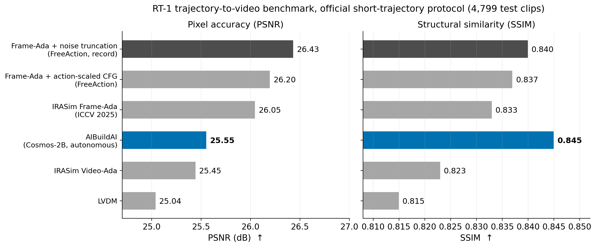

# RT-1 World Model: Autonomous Post-Training of Cosmos-Predict2.5

Built on NVIDIA Cosmos. An AIBuildAI agent autonomously post-trained the open
[Cosmos-Predict2.5-2B](https://arxiv.org/abs/2511.00062) action-conditioned
world model on the RT-1 robot manipulation domain: 29 hours on an 8x A100
node, no human intervention between launch and delivery.

## Result

Official IRASim short-trajectory benchmark, RT-1 test split (4,799 clips,
scored with the benchmark's released evaluation code):

| Method | PSNR | SSIM |
|---|---|---|
| Frame-Ada + noise truncation (FreeAction, record) | 26.44 | 0.840 |
| Frame-Ada + action-scaled CFG (FreeAction) | 26.20 | 0.837 |
| IRASim Frame-Ada (ICCV 2025) | 26.05 | 0.833 |
| **This release (autonomous)** | **25.56** | **0.845** |
| IRASim Video-Ada | 25.45 | 0.823 |
| LVDM | 25.04 | 0.815 |

The SSIM is the highest reported on this benchmark. PSNR ranks fourth,
0.49 dB below the best published trained model.



## Background

A world model predicts what a robot's camera will see next, given the current
frame and the actions about to be executed. Cosmos-Predict2.5-2B is NVIDIA's
open video world model; its action-conditioned variant was post-trained by
NVIDIA on a different robot platform, so it starts roughly ten dB behind the
published leaders on RT-1. Closing that gap is a domain adaptation problem:
new embodiment, new action scaling, new scene statistics.

## Task

Given the first frame of an RT-1 episode and the robot's action sequence,
predict the future frames.

- Input data: RT-1 episodes in IRASim format (`rgb.mp4`, per-step actions).
- Deliverables: predictions for every test episode, a standalone
  `inference.py`, and validation scores on held-out episodes never trained on.
- Hardware: 8x NVIDIA A100 40GB, fixed wall-clock budget. Training method was
  the agent's own choice.

We do not redistribute RT-1; download it from the
[IRASim release](https://github.com/bytedance/IRASim) and arrange it as
`$WM_ROOT/data/rt1/{videos,annotation,evaluation_videos,evaluation_cache}`.

## Final Model

The agent explored four fine-tuning strategies in parallel (full fine-tune,
partial unfreeze, high-rank adapter, LoRA continuation) and converged on:

- **Full fine-tuning of the 2B DiT** with FSDP2 sharding, EMA weights, and
  action-scaled conditioning, iterated over multiple warm-started rounds;
- **FreeAction-style initial-noise truncation at inference time**
  (training-free, implemented by the agent from the paper and A/B validated
  on its held-out episodes before adoption).

The solution code is the agent's own, lightly adapted for standalone use
(path parameterization, config defaults, and minor fixes).

## Files

| File | Purpose |
|---|---|
| `train.py`, `config.yaml` | The winning strategy's final training round (agent-written) |
| `inference.py` | Standalone inference: base model + fine-tuned weights + noise truncation |
| `gen_official_short.py` | Official-protocol generator for all 4,799 test clips (shardable across GPUs) |
| `sample_predictions/` | Example predicted clips |
| `figs/` | Result figures |
| `NOTICE` | NVIDIA Open Model License attribution |

Fine-tuned weights `best_model.pth` (4.25 GB, above GitHub's file limit):
**https://huggingface.co/AIBUILDAI-Inc/rt1-world-model**. Place at
`$WM_ROOT/finetuned/best_model.pth`. The weights are a derivative model of
Cosmos-Predict2.5-2B under the NVIDIA Open Model License (see `NOTICE`).

## Reproduce Inference

Expected layout under `WM_ROOT` (default `.`): the
[cosmos-predict2.5](https://github.com/nvidia-cosmos/cosmos-predict2.5) repo
with its environment, the released base checkpoint under
`checkpoints/Cosmos-Predict2.5-2B/robot/action-cond/`, RT-1 under `data/rt1/`,
and the fine-tuned weights under `finetuned/`.

```bash
export WM_ROOT=/path/to/workspace

# Predict test episodes
python inference.py --input <episodes_dir> --output submission.csv

# Official benchmark: generate all 4,799 clips (repeat per GPU), then score
CUDA_VISIBLE_DEVICES=0 python gen_official_short.py --num-shards 8 --shard-index 0 --out-dir results
```

Scoring uses IRASim's released code: `evaluate/compute_psnr_ssim.py` for
grayscale per-frame PSNR/SSIM, and `pytorch-fid` against the released
`test_fid_cache.npz` (flatten the per-clip frame folders first). The paper's
`fvd_15f` FVD variant lives in an unpublished stylegan-v fork; treat
cross-paper FVD comparisons with care.

## References

- Cosmos World Foundation Model Platform for Physical AI. arXiv:2501.03575.
- World Simulation with Video Foundation Models for Physical AI (Cosmos-Predict2.5). arXiv:2511.00062.
- IRASim: Learning Interactive Real-Robot Action Simulators. arXiv:2406.14540.
- FreeAction: Training-Free Techniques for Enhanced Fidelity of Trajectory-to-Video Generation. arXiv:2509.24241.
